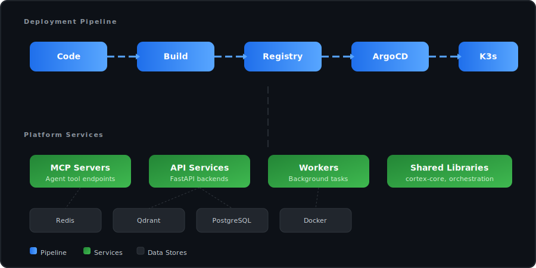

<div align="center">

# Cortex Platform

**The monorepo for all Cortex application code, libraries, and services.**

> ⚠️ **This project is archived.** No longer under active development.

</div>

---

## Structure

```
cortex-platform/
├── services/           # Microservices
│   ├── mcp-servers/   # MCP server implementations
│   ├── api/           # API services
│   └── workers/       # Background workers
├── lib/               # Shared libraries
│   ├── cortex-core/   # Core platform SDK
│   ├── orchestration/ # Agent orchestration
│   └── coordination/  # Multi-agent coordination
├── coordination/      # Agent coordination config
├── scripts/           # Build & deploy tooling
└── testing/           # Test suites
```

## Design Principles

- **Code lives here, infrastructure lives in cortex-gitops**
- Code → Container → Registry → ArgoCD → K3s
- GitOps-only deployment: no manual `kubectl apply`

## Architecture

<div align="center"></div>

## Tech Stack

`Python` · `TypeScript` · `FastAPI` · `Redis` · `Qdrant` · `Docker` · `K3s`

---

<div align="center">
<sub>Built with Claude. No longer maintained.</sub>
</div>
