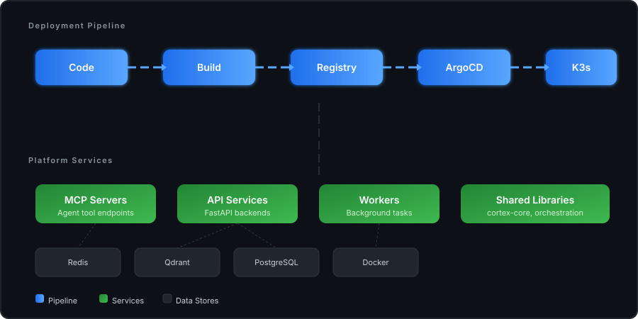

> [!NOTE]
> **Archived.** This repo is part of [Cortex](https://github.com/cortex-io), which is no longer under active development. It is kept as a working record: explore, fork and borrow freely, but no fixes or features are planned.

<p align="center"><sub><a href="https://github.com/cortex-io"><b>Cortex</b></a> &nbsp;·&nbsp; <a href="https://github.com/cortex-io/cortex">cortex</a> · <b>cortex-platform</b> · <a href="https://github.com/cortex-io/cortex-gitops">cortex-gitops</a> · <a href="https://github.com/cortex-io/cortex-k3s">cortex-k3s</a> · <a href="https://github.com/cortex-io/cortex-docs">cortex-docs</a> · <a href="https://github.com/cortex-io/cortex-construction-hq">cortex-construction-hq</a> · <a href="https://github.com/cortex-io/infrastructure-docs">infrastructure-docs</a></sub></p>

## What's here

All Cortex application code: the microservices, the MCP servers, and the shared libraries they're built on. **Code lives here; infrastructure lives in [cortex-gitops](https://github.com/cortex-io/cortex-gitops).**



## How code shipped

**code → container → registry → ArgoCD → K3s.** Deployment was GitOps-only: no manual `kubectl apply`.

## Layout

```
cortex-platform/
├── services/      # ~25 services: coordinator, moe-router, model-router, memory-service,
│                  #   health-monitor, cost-tracker, rag-validator, fabric-gateway, mcp-servers/ …
├── lib/           # shared libraries: cortex-core, orchestration, coordination, observability,
│                  #   rag, scheduler, security, tools, worker-pool
├── masters/       # master-agent definitions
├── workers/       # worker definitions
├── agents/        # agent framework (see AGENT_FRAMEWORK.md)
├── coordination/  # agent coordination state and config
├── infrastructure/
├── scripts/       # build and deploy tooling
├── testing/ tests/
└── docs/ examples/
```

Start with [QUICKSTART.md](QUICKSTART.md) and [AGENT_FRAMEWORK.md](AGENT_FRAMEWORK.md).

## Stack

`Python` · `TypeScript` · `FastAPI` · `Redis` · `Qdrant` · `PostgreSQL` · `Docker` · `K3s`

---

<p align="center"><sub>Part of the <a href="https://github.com/cortex-io">Cortex archive</a> · built with Claude</sub></p>
