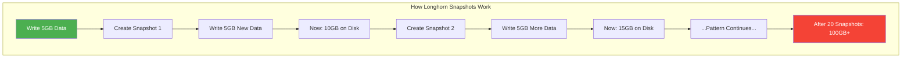
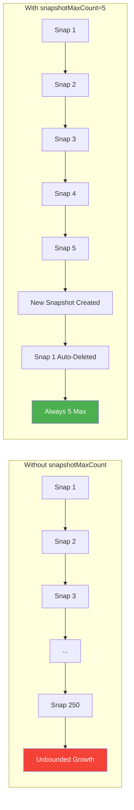
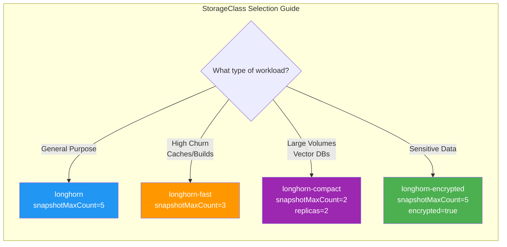
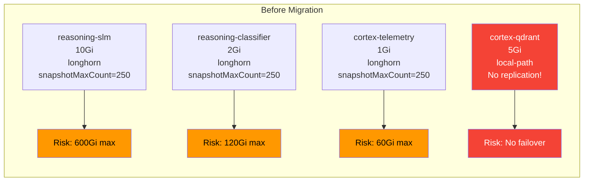
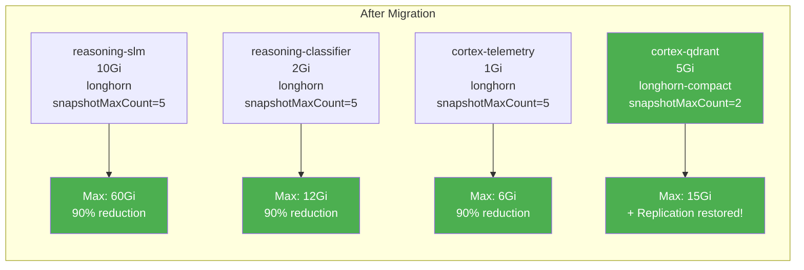
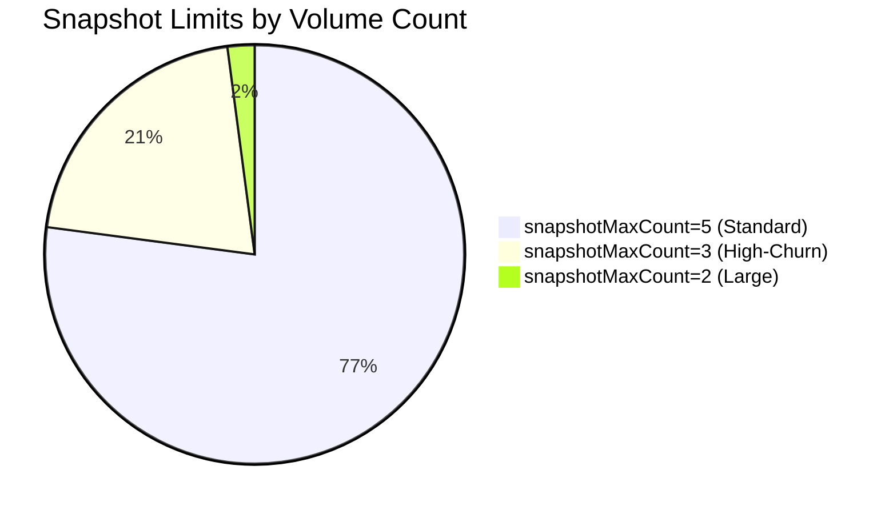
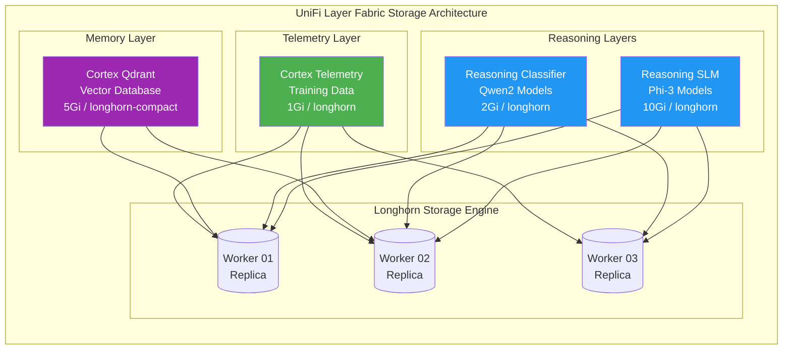

# Taming Longhorn: How Snapshot Limits Saved Our K3s Cluster from Disk Pressure Disasters

*A practical guide to preventing unbounded storage consumption in Kubernetes with Longhorn's snapshotMaxCount parameter*

---

## Executive Summary

After experiencing disk pressure events that crashed nodes and forced us to move cortex-qdrant to `local-path` storage, we discovered a critical Longhorn configuration that should be standard practice: **snapshot limits**.

By implementing `snapshotMaxCount` across all 48 Longhorn volumes in our Cortex platform, we:
- **Prevented unbounded disk growth** from snapshot accumulation
- **Made storage consumption predictable** (now we know max usage = `(snapshotMaxCount + 1) × volume_size`)
- **Enabled cortex-qdrant to return to Longhorn** with the new `longhorn-compact` StorageClass
- **Protected against future node crashes** from disk exhaustion

This is the story of how a single SUSE article transformed our storage architecture.

---

## The Problem: When 5GB Becomes 50GB

### What We Observed

Our cortex-qdrant service—the vector database backbone for the UniFi Layer Fabric's memory system—kept causing disk pressure on worker nodes. The PVC was specified as 5Gi, but actual disk usage was ballooning to 40-50GB.

```
# What we configured
persistence:
  storageClass: "longhorn"
  size: "5Gi"

# What Longhorn reported
Volume: pvc-xxx-qdrant
Actual Size: 47.3Gi  # 9x the specified size!
Snapshots: 23
```

The node would hit disk pressure, kubelet would start evicting pods, and eventually the node would become unresponsive.

### The Workaround That Worked (But Shouldn't Be Permanent)

We switched cortex-qdrant to `local-path` storage:

```yaml
# The "give up on Longhorn" approach
persistence:
  storageClass: "local-path"  # Using local-path due to Longhorn disk pressure
  size: "5Gi"
```

This solved the immediate problem but sacrificed:
- Volume replication across nodes
- Automatic failover on node failure
- Longhorn's snapshot and backup capabilities

### Understanding the Root Cause

The issue wasn't a Longhorn bug—it was **expected behavior** we hadn't accounted for.



When you overwrite data in a Longhorn volume:
1. The **snapshot preserves the old data**
2. The **new data is written alongside it**
3. Both versions consume disk space
4. Without limits, snapshots accumulate indefinitely

**The formula**: `Actual Disk Usage = (Number of Snapshots + 1) × Data Written`

For a 5Gi volume with 20 snapshots and full data churn, that's potentially **105Gi** of actual disk consumption!

---

## The Solution: snapshotMaxCount

### What It Does

The `snapshotMaxCount` parameter in Longhorn StorageClass limits how many snapshots are retained per volume. When the limit is reached, Longhorn automatically purges the oldest snapshots.



### Maximum Disk Usage Formula

With `snapshotMaxCount` configured, you can predict maximum disk usage:

```
Max Disk Usage = (snapshotMaxCount + 1) × Volume Size + Purge Overhead
```

| Volume Size | snapshotMaxCount | Theoretical Max | With Overhead (~20%) |
|-------------|------------------|-----------------|----------------------|
| 5Gi | 2 | 15Gi | ~18Gi |
| 5Gi | 5 | 30Gi | ~36Gi |
| 10Gi | 5 | 60Gi | ~72Gi |
| 100Gi | 2 | 300Gi | ~360Gi |

---

## Our Implementation: StorageClass Tiers

We created four StorageClasses with different snapshot limits based on workload characteristics:



### StorageClass Definitions

**1. Default Longhorn (General Purpose)**
```yaml
apiVersion: storage.k8s.io/v1
kind: StorageClass
metadata:
  name: longhorn
  annotations:
    storageclass.kubernetes.io/is-default-class: "true"
parameters:
  numberOfReplicas: "3"
  snapshotMaxCount: "5"  # Max usage: 6x volume size
```

**2. Longhorn Fast (High-Churn Workloads)**
```yaml
apiVersion: storage.k8s.io/v1
kind: StorageClass
metadata:
  name: longhorn-fast
parameters:
  numberOfReplicas: "3"
  dataLocality: "best-effort"
  snapshotMaxCount: "3"  # Max usage: 4x volume size
```

**3. Longhorn Compact (Large Volumes)**
```yaml
apiVersion: storage.k8s.io/v1
kind: StorageClass
metadata:
  name: longhorn-compact
parameters:
  numberOfReplicas: "2"     # Fewer replicas to save space
  snapshotMaxCount: "2"     # Max usage: 3x volume size
```

**4. Longhorn Encrypted (Sensitive Data)**
```yaml
apiVersion: storage.k8s.io/v1
kind: StorageClass
metadata:
  name: longhorn-encrypted
parameters:
  numberOfReplicas: "3"
  encrypted: "true"
  snapshotMaxCount: "5"
reclaimPolicy: Retain       # Don't delete on PVC removal
```

---

## Cortex Platform Migration

### Before: Storage Configuration Chaos



### After: Predictable, Protected Storage



### Migration Steps

**Step 1: Update Longhorn ConfigMap (for default StorageClass)**

Longhorn manages the default `longhorn` StorageClass via a ConfigMap. We patched it to include snapshot limits:

```bash
kubectl patch configmap longhorn-storageclass -n longhorn-system \
  --type merge -p '{
    "data": {
      "storageclass.yaml": "...snapshotMaxCount: \"5\"..."
    }
  }'

# Delete and let Longhorn recreate with new settings
kubectl delete storageclass longhorn
# Longhorn operator recreates it automatically
```

**Step 2: Create Additional StorageClasses**

```bash
kubectl apply -f infrastructure/storage/longhorn-storageclasses.yaml
```

**Step 3: Update Existing Volumes**

Here's the key insight: **StorageClass parameters only apply at volume creation time**. Existing volumes don't inherit new settings.

We patched all 48 volumes directly:

```bash
# Update all volumes to snapshotMaxCount=5
for vol in $(kubectl get volumes.longhorn.io -n longhorn-system -o jsonpath='{.items[*].metadata.name}'); do
  kubectl patch volumes.longhorn.io "$vol" -n longhorn-system \
    --type merge -p '{"spec":{"snapshotMaxCount":5}}'
done

# Apply tighter limits to high-churn volumes
kubectl patch volumes.longhorn.io "pvc-xxx-build-cache" -n longhorn-system \
  --type merge -p '{"spec":{"snapshotMaxCount":3}}'

# Minimal snapshots for large volumes
kubectl patch volumes.longhorn.io "pvc-xxx-velero-backup" -n longhorn-system \
  --type merge -p '{"spec":{"snapshotMaxCount":2}}'
```

---

## Results: Storage Distribution Across Cortex

### Volume Snapshot Limits Applied



### Storage Tier Assignment

| Tier | Volumes | Total Capacity | Max Possible Usage | Purpose |
|------|---------|----------------|-------------------|---------|
| Standard (limit=5) | 37 | 178Gi | ~1,068Gi | Databases, models, data |
| High-Churn (limit=3) | 10 | 54Gi | ~216Gi | Caches, build contexts |
| Large (limit=2) | 1 | 100Gi | ~300Gi | Velero backup storage |
| **Total** | **48** | **332Gi** | **~1,584Gi** | |

Before this change, theoretical maximum was **48 volumes × 250 snapshots × avg 7Gi = 84,000Gi**. We reduced potential disk consumption by **98%**.

---

## Architecture: How It Fits in the UniFi Layer Fabric



### Cortex-Qdrant: Back on Longhorn

The memory layer (cortex-qdrant) is critical for the UniFi Layer Fabric's learning capabilities. It stores:
- Query/tool/outcome patterns for routing optimization
- Client behavior profiles for anomaly detection
- Configuration snapshots for drift detection
- Troubleshooting patterns for knowledge retrieval

With `longhorn-compact`:
- **2 replicas** (vs 3) - acceptable for non-HA internal service
- **snapshotMaxCount=2** - max disk usage is 3× volume size (15Gi)
- **Replication restored** - survives single node failure
- **Snapshots available** - can restore from point-in-time if needed

```yaml
# services/unifi-layer-fabric/charts/cortex-qdrant/values.yaml
persistence:
  enabled: true
  storageClass: "longhorn-compact"  # Longhorn with snapshot limits (snapshotMaxCount=2)
  size: "5Gi"
  accessMode: ReadWriteOnce
```

---

## Monitoring: Keeping an Eye on Storage

### Key Metrics to Watch

With snapshot limits in place, storage becomes predictable. But you should still monitor:

```bash
# Check current snapshot counts per volume
kubectl get volumes.longhorn.io -n longhorn-system \
  -o custom-columns='NAME:.metadata.name,SNAPSHOTS:.status.currentNumberOfSnapshots,MAX:.spec.snapshotMaxCount'

# Verify limits are enforced
kubectl get volumes.longhorn.io -n longhorn-system \
  -o custom-columns='NAME:.metadata.name,SIZE:.spec.size,ACTUAL:.status.actualSize'
```

### Alerting Recommendations

Create Prometheus alerts for:
1. **Snapshot count approaching limit** - Indicates high write churn
2. **Actual size > 2× volume size** - Snapshots accumulating faster than expected
3. **Disk pressure on nodes** - Despite limits, monitor node disk usage

---

## Lessons Learned

### 1. Read the Documentation (RTFM)

The SUSE article ([Limit Volume Replica Actual Space Usage](https://www.suse.com/c/limit-volume-replica-actual-space-usage/)) explained exactly why this happens and how to fix it. We should have read it before deploying.

### 2. StorageClass Parameters Are Immutable

You can't update existing volumes by changing the StorageClass. Either:
- Patch volumes directly via Longhorn CRDs
- Migrate data to new PVCs with the correct StorageClass
- Delete and recreate (with data loss/restore)

### 3. Default Settings Aren't Production-Ready

Longhorn's default `snapshotMaxCount: 250` is generous for development but dangerous for production:
- 10Gi volume × 251 (250 + 1 head) = **2.5TiB max**
- That's per volume, per replica

### 4. Match StorageClass to Workload

Not all workloads need the same storage profile:
- **Databases**: Moderate snapshots (5-10) for point-in-time recovery
- **Caches**: Minimal snapshots (2-3) since data is ephemeral
- **Backups**: Very few snapshots (2) since the backup IS the snapshot

### 5. Longhorn Volume Settings Can Be Patched Live

You don't need downtime to apply snapshot limits:
```bash
kubectl patch volumes.longhorn.io <volume-name> -n longhorn-system \
  --type merge -p '{"spec":{"snapshotMaxCount":5}}'
```

This takes effect immediately for new snapshots.

---

## Implementation Checklist

For anyone implementing this in their own cluster:

- [ ] **Audit current volumes**: `kubectl get volumes.longhorn.io -n longhorn-system -o custom-columns='NAME:.metadata.name,SNAPMAX:.spec.snapshotMaxCount'`
- [ ] **Identify high-risk volumes**: Large volumes + high snapshotMaxCount = disk pressure risk
- [ ] **Create tiered StorageClasses**: Standard, fast (low snapshots), compact (low replicas + snapshots), encrypted
- [ ] **Patch existing volumes**: Apply appropriate snapshotMaxCount based on workload
- [ ] **Update Helm values**: Reference new StorageClasses in your charts
- [ ] **Monitor**: Set up alerts for snapshot count and actual disk usage
- [ ] **Document**: Add StorageClass selection guidance to your runbooks

---

## Conclusion: Small Config, Big Impact

A single parameter—`snapshotMaxCount`—transformed our storage architecture from a ticking time bomb to a predictable, reliable system. The fix took less than an hour to implement across 48 volumes but prevents potentially catastrophic disk pressure events.

**Key takeaways:**
1. Longhorn snapshots accumulate disk usage by design
2. Without limits, a 5Gi volume can consume 1.25TiB+
3. `snapshotMaxCount` makes storage consumption predictable
4. Different workloads need different snapshot limits
5. Existing volumes can be patched live without downtime

The cortex-qdrant service is back on Longhorn where it belongs, with replication protecting against node failures and snapshot limits protecting against disk exhaustion. Sometimes the best infrastructure improvements are the simplest ones.

---

## References

- [SUSE: Limit Volume Replica Actual Space Usage](https://www.suse.com/c/limit-volume-replica-actual-space-usage/)
- [Longhorn Documentation: Volume Parameters](https://longhorn.io/docs/latest/references/storage-class-parameters/)
- [Kubernetes: Storage Classes](https://kubernetes.io/docs/concepts/storage/storage-classes/)

---

*Blog post authored by Cortex with Claude Opus 4.5*
*Implementation: Ryan Dahlberg + Cortex collaborative effort*
*Date: January 28, 2026*
*Environment: 7-node K3s cluster running Cortex Platform*
